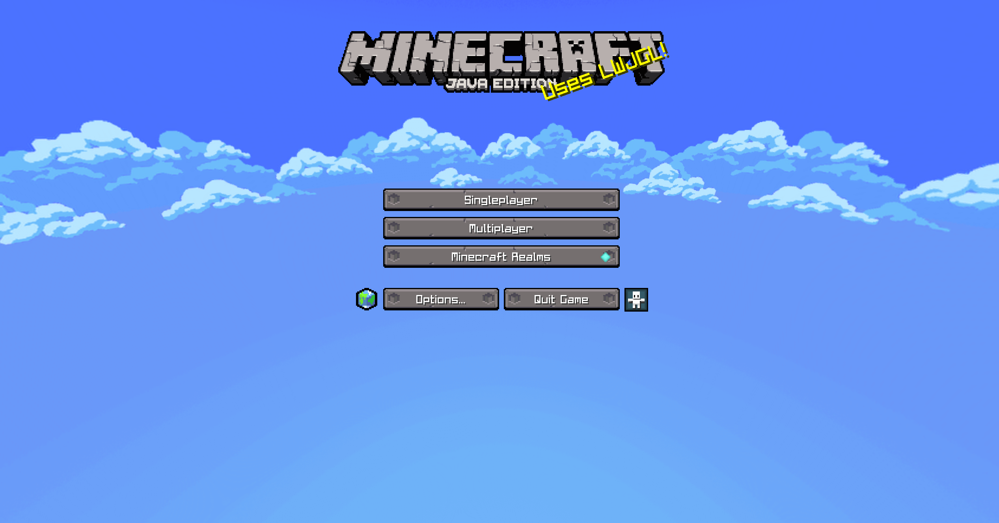
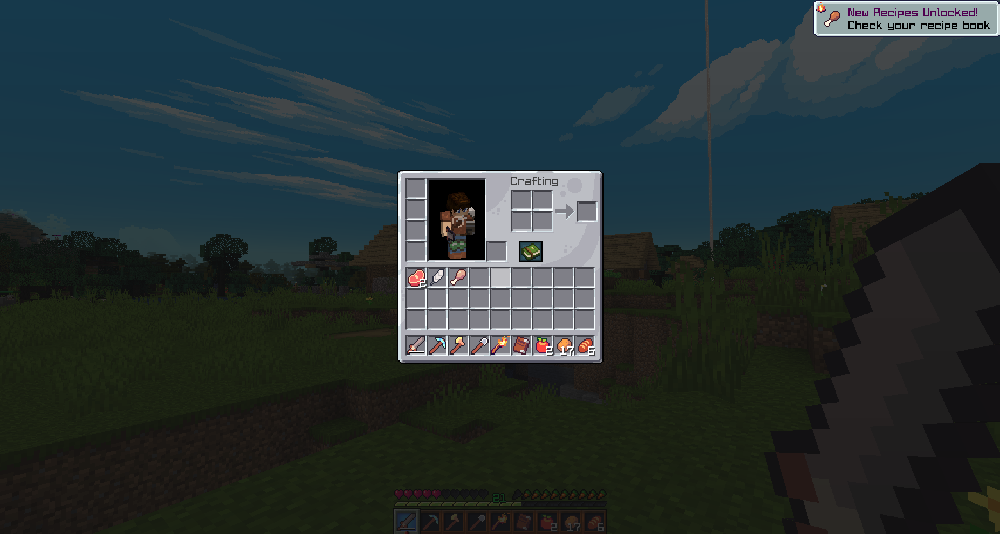
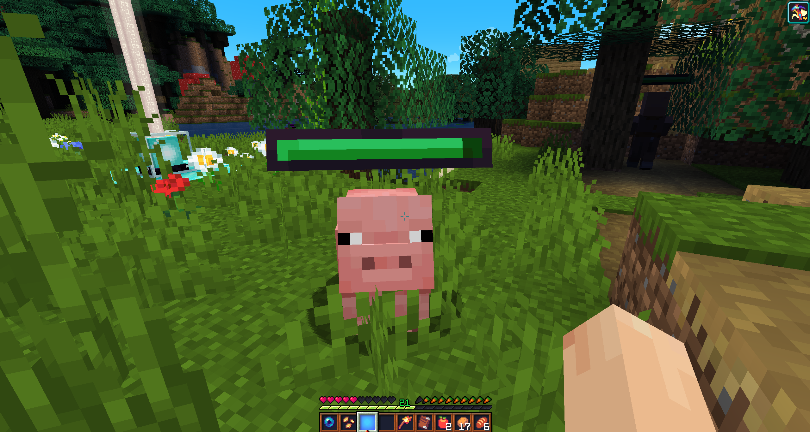
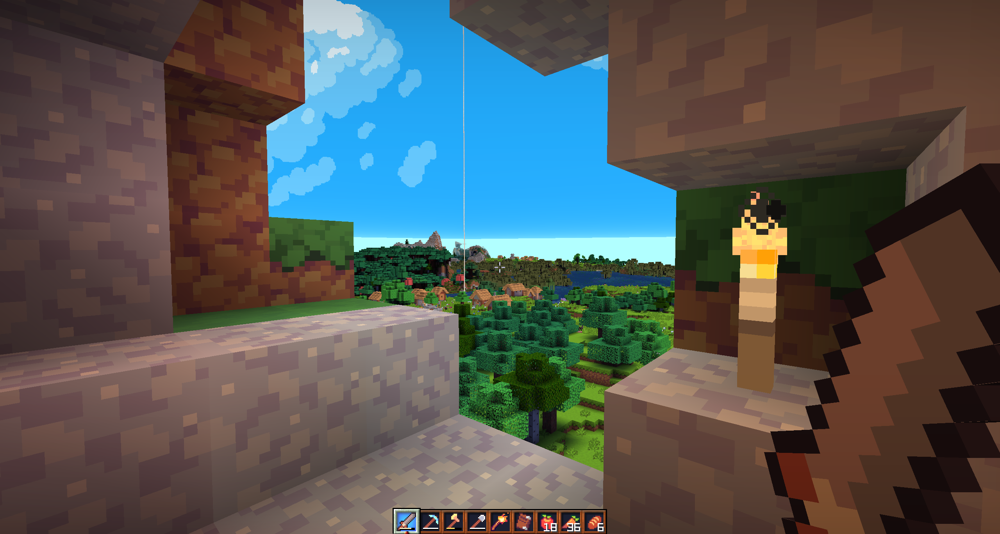

# Forlhörn - Resource Pack
_(Il a été spécialement créé pour le serveur Forlhörn)_


C'est un ressource pack pour le jeu Minecraft Java Édition. Les textures utilisées ont une définition de 16X16. 
C'est un pack au look coloré et cartoon, il a été conçu spécialement pour être utilisé par des petites configurations.
Une grosse refonte des émissions de lumière et des effets en jeu a pu être effectuée grâce à Optifine.
Le pack est orienté RPG donc des mécaniques ou modifications en jeu seront axées sur ce type de gameplay.

## Pour commencer

### Pré-requis

Pour installer le ressource pack, il est nécessaire :

* De jouer sous la version 1.16 du jeu au minimum.
* D'utiliser [Optifine](https://optifine.net/downloads)
* Essayer le Shader Forlhörn ! 😁 (Lien ici -> *Prochainement* )

### Installation

Pour l'installation, rien de plus simple :

* Faites le raccourci clavier `Win+R`
* Dans la boite de dialogue, tapez `%appdata%`
* Rendez-vous dans le répertoire `.minecraft`
* Et ensuite dans le répertoire `resourcepacks`
* Il ne vous reste qu'à couper le .zip à la racine de ce dossier.

## Activation en jeu

Ensuite il ne reste plus qu'à activer le ressource pack en jeu. Et vous devriez obtenir ceci :



## Aperçu en jeu

Système d'inventaire en mode survie :



Système de vie dynamique :



Mise à jour des textures d'environnement :



## Versions

* Version 1.0 - Révision du GUI, des effets et de l'éclairage en jeu.
* Version 1.1 - Modification des textures et des modèles des items.
* Versions 1.2 - Mise en place d'un système de vie dynamique. (Fonctionnalité de gameplay RPG)
* Versions 1.3 - Mise à jour des textures et modèles.

Grosse mise à jour pour la 1.4 :

* Correction de nombreux bugs visuels comme les minerais de cuivre, les effets de particules, les échelles, les pommes dorées (mauvaise texture)...
* Ajout de nouvelles textures pour les axolots, enderman, ours, abeilles, poissons, renards...
* Modifications de sons en jeu, je vous laisse découvrir tout ça...
* Création d'une OST en jeu unique.

## Road-Map

```
Pour la semaine prochaine, la 1.5 sera composée :
* Des nouvelles textures pour les mobs.
* Des nouveaux sons ambiants.
* Des nouvelles musiques pour les CD.
* Corrections de certains items pour une meilleure cohérence graphique.
* Changements de certaines textures de block pour une meilleure lisibilité.
* Une montre plus efficace pour connaître le moment de la journée.
* Ajouts d'un HoloHUD pour les ruches d'abeilles, idéal pour faire de l'apiculture.
* Ajout d'aide dans les différents menus. (Au survols de la souris)

Pour la 1.6 (Date inconnue pour le moment) [Weapon Update] :
* Modification des textures des armes afin d'y inclure une gemme magique pour connaitre son état. (Bleu = Neuve, Vert = Bon état, Jaune = Abîmée, Rouge = Presque cassée).
* La même pour les armures.
* Modification de la texture du bouclier.
* Ajouts de textures uniques pour chaque enchantement, pour chaque armes, suivant son type (Or, Fer, Bois, Diamant, Netherite...) et suivant l'enchantement appliqué, une texture sera chargé en jeu.
* Modifications des sons des armes et des dégâts infligés ou reçus.

Pour la 1.7 (Date inconnue pour le moment) [1.18 Compatibility Update] :
* Ajouts de nouvelles textures pour les nouveaux blocs
* Ajouts de nouvelles textures pour les nouveaux items.
* Ajouts de nouveaux sons d'ambiances pour les cavernes.
* Modification des textures du Warden.
* Séparation du module de lumière pour plus de personnalisation. (Clair, sombre, obscure)

---> Toujours compatible de la 1.9 - 1.18.

Pour la 1.8 (Date inconnue pour le moment) [Mineral Update] :
* Nouvelles textures pour les minerais, textures animées et luminescentes.
* Changements de la végétations des cavernes.
* Changements des textures des spéléothèmes.
* Ajouts de sons dynamiques pour l'exploration dans les cavernes.
* Les minerais récupérés (Items) auront aussi leur refontes.
* Ajouts d'une émission de lumière pour le joueurs utilisant un shader en jeu.
La 1.9 et la 2.0 seront concentrées sur le Nether et L'Ender. (Plus d'infos bientôt)
```
